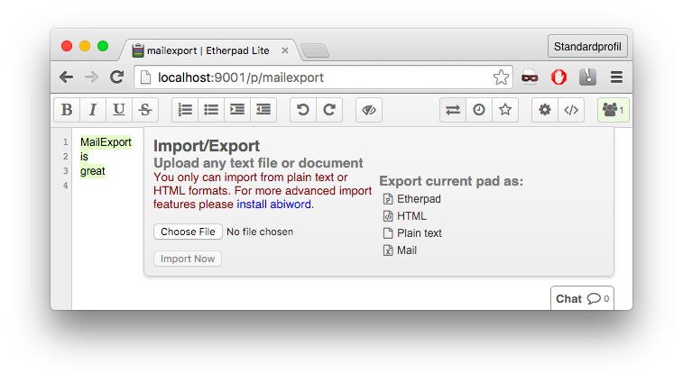

Mailexport for etherpad-lite
=============



This plugin adds a new export option to send the content of the current revision of an etherpad via mail. All options of sending the mail (SMTP-Connection, Reciever) are currently set in the settings.


## Install

mailexport should be installable using `admin/plugins` or manually:

    cd etherpad_lite
    npm install ep_mailexport
    <Restart etherpad-lite>


## Config

Add the following or similar default to your settings at </admin/settings> or `settings.json`:

```
  "ep_mailexport": {
    "config": {
      "host": "smtp.example.com",
      "port": 465,
      "secure": true,
      "auth": {
          "user": "user@example.com",
          "pass": "secret"
      },
      "authMethod": "CRAM-MD5"
    },
    "email": {
        "from": "user@example.com",
        "to": [
            "anna@example.com",
            "bob@example.com"
        ]
    }
  }
```

* **ep_mailexport.** defines the options for this plugin:
    - **ep_mailexport.config** defines everything related to sending mail in general on the server. All options defined by nodemailer [here](https://github.com/nodemailer/nodemailer#send-using-smtp) are allowed
    - **ep_mailexport.email** defines default properties of each mail that is created. All possible options are defined nodemailer [here](https://github.com/nodemailer/nodemailer#e-mail-message-fields). The options only serve as default arguments. In future development the user will be given the possibility to override them when actually sending the mail.
